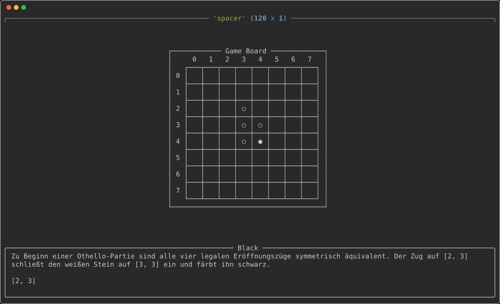
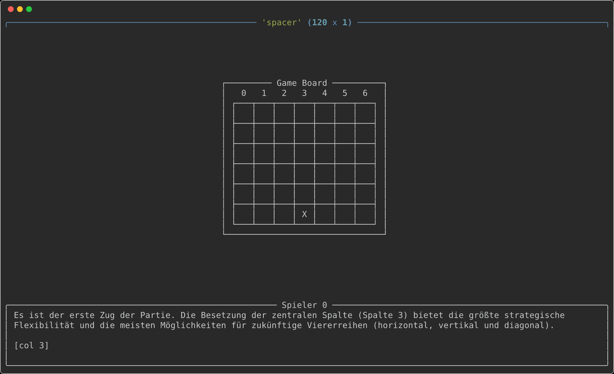
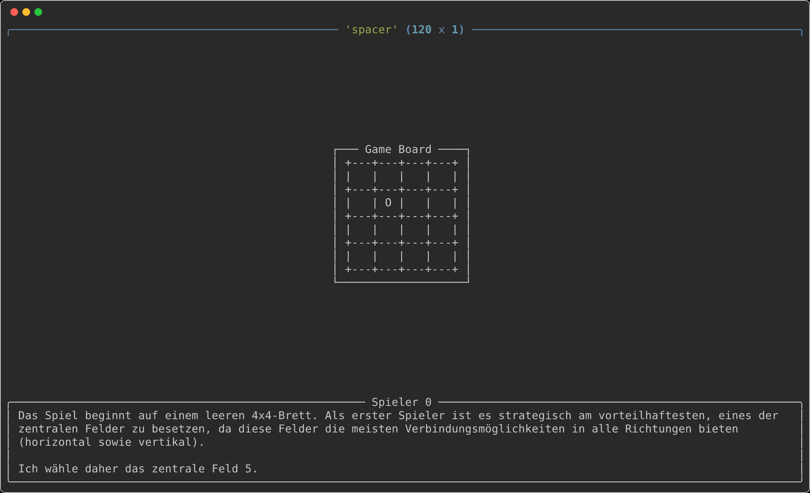
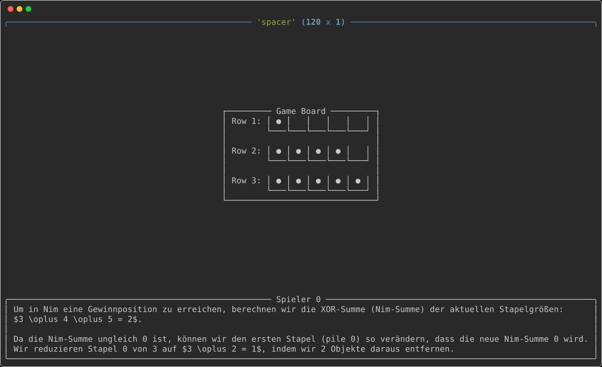

<div align="center">

<picture>
  <source media="(prefers-color-scheme: light)" srcset="/docs/ta_black.svg">
  
</picture>

A suite of 100+ single-, two-, and multi-player text-based games for benchmarking and training LLMs.

<h3>

[Play](https://textarena.ai) | [Leaderboard](https://textarena.ai/leaderboard) | [Games](https://github.com/LeonGuertler/TextArena/blob/main/textarena/envs/README.md) | [Examples](https://github.com/LeonGuertler/TextArena/tree/main/examples)

</h3>

[](https://pypi.org/project/textarena)
[](https://pepy.tech/projects/textarena)
[](https://github.com/LeonGuertler/TextArena/stargazers)
[](https://discord.gg/dnScm47kNq)
[](https://arxiv.org/abs/2504.11442)

</div>

## Introduction

**TextArena** is an open-source framework for evaluating and training language-model agents through competitive and cooperative text-based games.

It provides **100+ single-, two-, and multi-player environments** through an interface styled after [OpenAI Gym](https://github.com/openai/gym), ranging from classic board and card games to negotiation, social deduction, and multi-agent reasoning tasks. TextArena makes it easy to plug in language-model agents, run self-play or model-vs-model evaluations, and build training pipelines around interactive environments. It also supports 192 languages, enabling the same environments to be presented to agents through different language interfaces.

## Updates

- **14/08/2026** TextArena goes multilingual: **192 languages** are now supported.
- **28/05/2026** We released the findings of **MindGames** on [arXiv](https://arxiv.org/pdf/2605.29512).
- **31/03/2026** We released the game trajectories from our NeurIPS 2025 competition, **MindGames**, [here](https://huggingface.co/datasets/mindgameschallenge/MGC2025).
- **26/11/2025** We added negotiation games.
- **31/07/2025** We added **SettlersOfCatan** to TextArena.
- **14/07/2025** We announced [**MindGames**](https://www.mindgamesarena.com/), a NeurIPS 2025 competition for training LLMs on TextArena games that require theory of mind.
- **01/07/2025** We released v0.6.9 with **100 games**, simplified states, new observation wrappers for training, and default environment wrappers.
- **01/07/2025** We released [**SPIRAL: Self-Play on Zero-Sum Games Incentivizes Reasoning via Multi-Agent Multi-Turn Reinforcement Learning**](https://arxiv.org/pdf/2506.24119), introducing RL through self-play on TextArena games as a potential new training paradigm.
- **22/06/2025** We released [**UnstableBaselines**](https://github.com/LeonGuertler/UnstableBaselines), a lightweight asynchronous online RL library for training LLMs on TextArena games.
- **16/04/2025** We released the TextArena paper on [arXiv](https://arxiv.org/pdf/2504.11442).
- **14/02/2025** We released the new stable version on both PyPI and the website.
- **31/01/2025** We released the initial demo, which was highlighted by Andrej Karpathy — and promptly crashed all our servers.

## Getting Started

### Installation

Install TextArena directly from PyPI:

```bash
pip install textarena
```

### Offline Play

Agents only need to implement a `__call__` function that accepts a string observation and returns a string action. We provide several basic agents [here](https://github.com/LeonGuertler/TextArena/blob/main/textarena/agents/basic_agents.py).

The example below lets **GPT-4o-mini** play against **anthropic/claude-3.5-haiku** in a game of _TicTacToe_.

We use the `OpenRouterAgent`, so first set your OpenRouter API key:

```bash
export OPENROUTER_API_KEY="YOUR_OPENROUTER_API_KEY"
```

Then initialize the agents and environment:

```python
import textarena as ta

# Initialize agents
agents = {
    0: ta.agents.OpenRouterAgent(model_name="GPT-4o-mini"),
    1: ta.agents.OpenRouterAgent(model_name="anthropic/claude-3.5-haiku"),
}

# Initialize the environment
env = ta.make(env_id="TicTacToe-v0")

# Optional visualization wrapper
env = ta.wrappers.SimpleRenderWrapper(env=env)

env.reset(num_players=len(agents))

done = False
while not done:
    player_id, observation = env.get_observation()
    action = agents[player_id](observation)
    done, step_info = env.step(action=action)

rewards, game_info = env.close()
```

## Multilingual Support

TextArena supports UI localization across **192 languages** for more than 60% of its games. See [`textarena/envs/README.md`](textarena/envs/README.md) for a complete list of games with multilingual support, and [`textarena/utils/locales`](textarena/utils/locales) for the localization files covering all 192 supported languages. Languages can be assigned independently to each player using `lang_mapping`, allowing the same environment to be presented through different language interfaces.

Examples of multilingual game interfaces:


<div align="center">






</div>

### Language Coverage

* **8 languages** are manually reviewed by native speakers.
* **42 additional high- and mid-resource languages** are translated and automatically verified.
* **142 low-resource languages** are produced using open machine translation and evaluated using a multi-model fidelity pipeline.

Low-resource localizations are machine-verified rather than native-reviewed and are labeled by confidence tier.

### Multilingual Usage

Languages can be assigned independently to each player using `lang_mapping` in `env.reset()`:

```python
import textarena as ta

agents = {
    0: ta.agents.OpenRouterAgent(model_name="GPT-4o-mini"),
    1: ta.agents.OpenRouterAgent(model_name="anthropic/claude-3.5-haiku"),
}

env = ta.make(env_id="TicTacToe-v0")

env.reset(
    num_players=len(agents),
    lang_mapping={0: "en", 1: "de"},
)

done = False
while not done:
    player_id, observation = env.get_observation()
    action = agents[player_id](observation)
    done, step_info = env.step(action=action)

rewards, game_info = env.close()
```

<details>
<summary><b>Translation Quality and Verification</b></summary>

The 142 low-resource UI localizations are produced using **NLLB-200** and verified for meaning fidelity by two independent model families: **Llama-3.1-405B** and **Qwen2.5-72B**.

Each translated string is checked by both model families. Agreements are automatically accepted, while disagreements are adjudicated with an additional Llama-3.1-405B judgment. Confirmed translation errors are repaired under structural checks that preserve placeholders, command tokens, and template slots.

These localizations are **machine-verified, not native-reviewed**.

Languages are grouped into two confidence tiers:

* **Certified-flagged:** pre-repair meaning fidelity of at least 85%.
* **Experimental:** pre-repair meaning fidelity below 85%; structurally valid and repaired, but requiring substantially more machine correction.

All shipped low-resource localizations reach at least **94% post-repair measured fidelity** under the automated evaluation pipeline.

Detailed per-language confidence scores, target-language coverage, and residual bug counts are available in [`textarena/utils/locales/_trackb_confidence.json`](textarena/utils/locales/_trackb_confidence.json).

At runtime:

```python
from textarena.utils.locales.language_confidence import warn_if_flagged

warn_if_flagged(lang)
```

This emits a `UserWarning` for non-certified locales.

For those interested in how these localizations were generated and validated at scale, the multilingual generation pipeline, including the tooling used to translate, verify, repair, and evaluate localizations, is available on the [`multilingual`](https://github.com/TextArena/TextArena/tree/multilingual) branch.

For research using these localizations, we recommend reporting the confidence tier of each language and distinguishing machine-verified translations from native-reviewed ones.

</details>


## Citation 

If you use **TextArena** in your research, please cite:

```bibtex
@misc{guertler2025textarena,
    title={TextArena},
    author={Leon Guertler and Bobby Cheng and Simon Yu and Bo Liu and Leshem Choshen and Cheston Tan},
    year={2025},
    eprint={2504.11442},
    archivePrefix={arXiv},
    primaryClass={cs.CL},
    url={https://arxiv.org/abs/2504.11442},
}
```

## Contributing

All forms of contribution are very welcome. Whether you're adding new games, improving existing functionality, fixing bugs, or helping with documentation and translations, we'd be glad to have your help. 

Check out the open issues or join us on [Discord](https://discord.gg/dnScm47kNq) to get started.

Some examples:

- Make RushHour board generation algorithmic.
- Extend FifteenPuzzle to arbitrary sizes.
- Review multilingual translations.
- Improve rendering, tests, or tooling.


