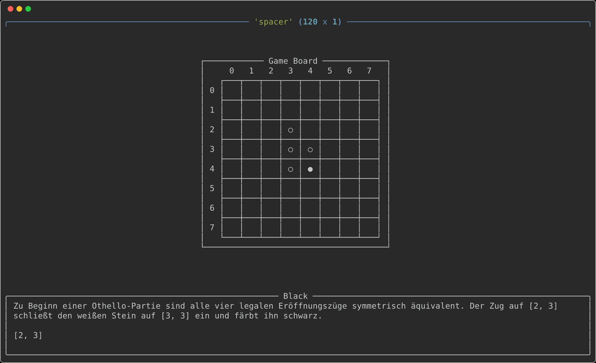
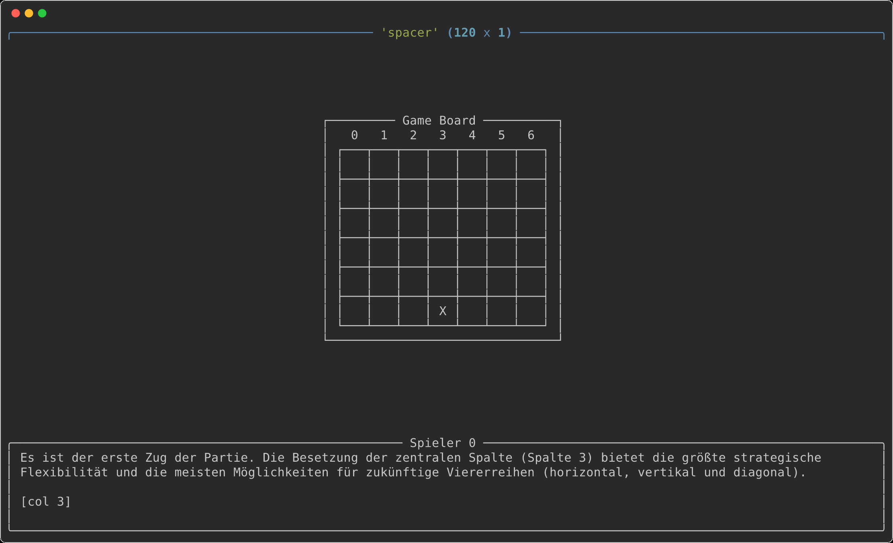
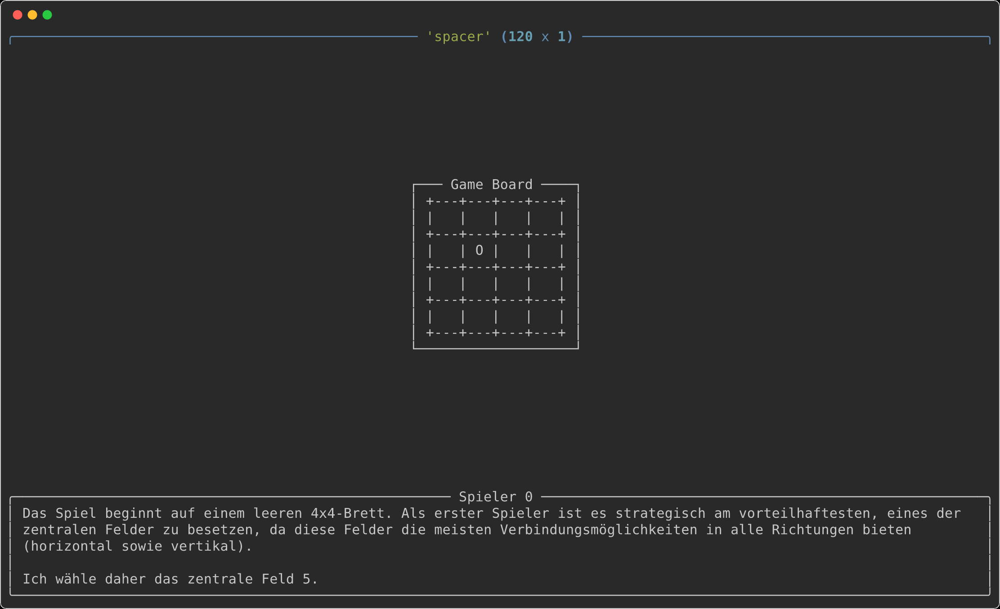
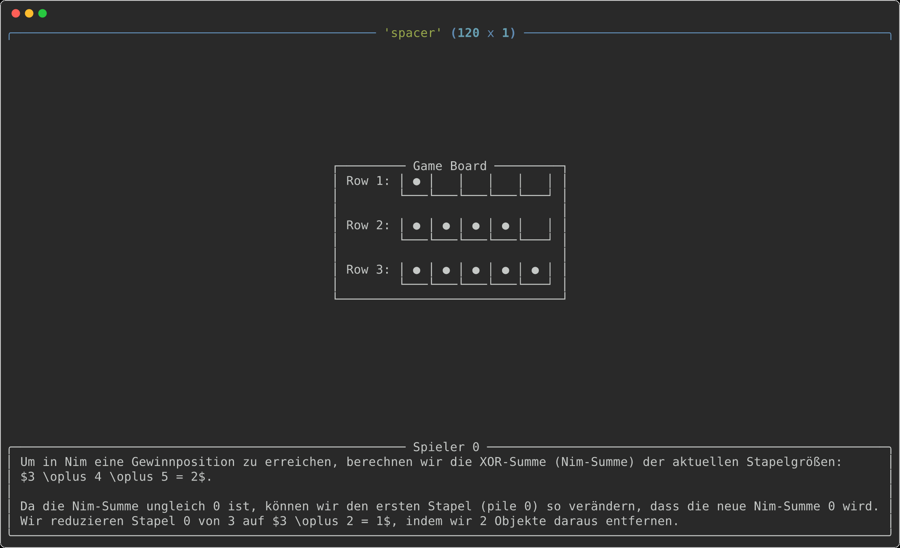

<div align="center">

<picture>
  <source media="(prefers-color-scheme: light)" srcset="/docs/ta_black.svg">
  
</picture>

108 single-, two-, and multi-player text games for evaluating and training LLM agents.

<h3>

[Games](textarena/envs/README.md) | [Examples](examples) | [Paper](https://arxiv.org/abs/2504.11442) | [Discord](https://discord.gg/dnScm47kNq)

</h3>

[](https://pypi.org/project/textarena)
[](https://pepy.tech/projects/textarena)
[](https://github.com/LeonGuertler/TextArena/stargazers)
[](https://discord.gg/dnScm47kNq)
[](https://arxiv.org/abs/2504.11442)

</div>

TextArena puts board and card games, puzzles, negotiation, social deduction, and other multi-agent tasks behind
one Gym-style interface. Every game enforces its own rules, shows each player only what they may see, and returns
rewards, so models can be evaluated against each other or trained through self-play. A seed replays a game
exactly, and observations can be translated into 192 languages.

## Installation

```bash
pip install textarena
```

TextArena needs Python 3.10 or newer and depends only on `openai` and `rich`.

## Quick start

Two models play TicTacToe through [OpenRouter](https://openrouter.ai) (set `OPENROUTER_API_KEY` first):

```python
import textarena as ta

agents = {
    0: ta.agents.OpenRouterAgent(model_name="openai/gpt-4o-mini"),
    1: ta.agents.OpenRouterAgent(model_name="anthropic/claude-3.5-haiku"),
}

env = ta.make("TicTacToe-v0")
env.reset(num_players=len(agents), seed=42)

done = False
while not done:
    player_id, observation = env.get_observation()
    action = agents[player_id](observation)
    done, step_info = env.step(action)

rewards, game_info = env.close()
```

`get_observation()` returns the player who acts next and the text they see; `close()` returns each player's reward
and game info. An agent is any callable that turns an observation string into an action string. Besides
`OpenRouterAgent`, TextArena ships `HumanAgent` for playing in the terminal (try `python demo.py`) and
`TinkerAgent` for models trained with Tinker.

## Actions

Games take bare actions such as `4`, `roll`, or `e2e4`. Models are asked to reason freely and put their move inside
`<action>...</action>` tags; the built-in agents pass only the tag contents to `env.step`, and
`ta.extract_action(response)` does the same for your own agents. An invalid action is never applied: the player is
told why and can try again, within a limit set by each game.

## Observations

Every configuration is registered twice:

| ID | Each observation contains | Use it when |
| --- | --- | --- |
| `TicTacToe-v0` | only the messages since the player's last turn | the agent keeps the conversation history itself |
| `TicTacToe-v0-mdp` | everything needed to act: the prompt, the game's messages, and the latest board | each step should stand on its own, as in RL training |

## Games

There are 30 single-player, 52 two-player, and 26 multi-player games. The [catalog](textarena/envs/README.md)
lists them all, and each game's README covers its rules, actions, rewards, and registered configurations. Settings
that are not registered are a keyword away: `ta.make("Chess-v0", max_turns=250)`.

## Training

[`examples/tinker`](examples/tinker) is a compact self-play RL loop on Tinker. Projects built on TextArena include:

- [SPIRAL](https://arxiv.org/pdf/2506.24119): reinforcement learning through self-play on zero-sum games improves
  reasoning.
- [UnstableBaselines](https://github.com/LeonGuertler/UnstableBaselines): a lightweight asynchronous online RL
  library for TextArena games.
- [MindGames](https://www.mindgamesarena.com/): a NeurIPS 2025 competition on games that require theory of mind,
  with released [trajectories](https://huggingface.co/datasets/mindgameschallenge/MGC2025) and
  [findings](https://arxiv.org/pdf/2605.29512).

## Watching and recording games

`ta.wrappers.SimpleRenderWrapper(env)` draws the board and the conversation in the terminal. With
`record_dir="frames", record_only=True` it saves every frame as a fixed-size SVG instead, which is how the GIFs
below were made.

## Multilingual games

Games are written in English. `TranslationWrapper` translates each player's observations into that player's
language, even when players in the same match use different languages:

```python
env = ta.make("TicTacToe-v0")
env = ta.wrappers.TranslationWrapper(env, lang={0: "en", 1: "de"})
```

Actions always stay in English, since that is what the games parse. Each game keeps its translations in a
`locales.json` next to its code, keyed by the exact English line, so a line whose English wording changes falls
back to English instead of showing an outdated translation. `python scripts/locales.py coverage --lang de` reports
how much of each game is translated.

<div align="center">






</div>

Of the 192 languages, 8 are reviewed by native speakers, 42 high- and mid-resource languages are translated and
automatically verified, and 142 low-resource languages are machine-translated and machine-verified.
`TranslationWrapper` emits a `UserWarning` when you select one of the low-resource languages.

<details>
<summary><b>How the low-resource translations were made and verified</b></summary>

The 142 low-resource localizations are produced with **NLLB-200** and checked for meaning fidelity by two
independent model families, **Llama-3.1-405B** and **Qwen2.5-72B**. Strings both judges accept are kept;
disagreements are settled by an additional Llama-3.1-405B judgment. Confirmed errors are repaired under structural
checks that preserve placeholders, command tokens, and template slots.

Languages fall into two confidence tiers:

* **Certified-flagged:** meaning fidelity of at least 85% before repair.
* **Experimental:** meaning fidelity below 85% before repair; structurally valid and repaired, but with
  substantially more machine correction.

All shipped low-resource localizations reach at least 94% measured fidelity after repair. Per-language scores are
in [`textarena/wrappers/locale_confidence.json`](textarena/wrappers/locale_confidence.json), and the pipeline that
translated, verified, and repaired them is on the
[`multilingual`](https://github.com/TextArena/TextArena/tree/multilingual) branch. Research using these
localizations should report each language's confidence tier and distinguish machine-verified from native-reviewed
translations.

</details>

## Contributing

Contributions of all kinds are welcome: new games, fixes, documentation, and translations. To work on TextArena:

```bash
pip install -e ".[test]"
pytest
```

[Adding a game](textarena/envs/README.md#adding-a-game) describes the folder layout and the engine hooks. After
changing a game, `python scripts/generate_env_docs.py` updates the generated parts of the docs and
`python scripts/locales.py extract` updates the translation catalogs. Questions and ideas are welcome on
[Discord](https://discord.gg/dnScm47kNq).

## Citation

```bibtex
@misc{guertler2025textarena,
    title={TextArena},
    author={Leon Guertler and Bobby Cheng and Simon Yu and Bo Liu and Leshem Choshen and Cheston Tan},
    year={2025},
    eprint={2504.11442},
    archivePrefix={arXiv},
    primaryClass={cs.CL},
    url={https://arxiv.org/abs/2504.11442},
}
```
